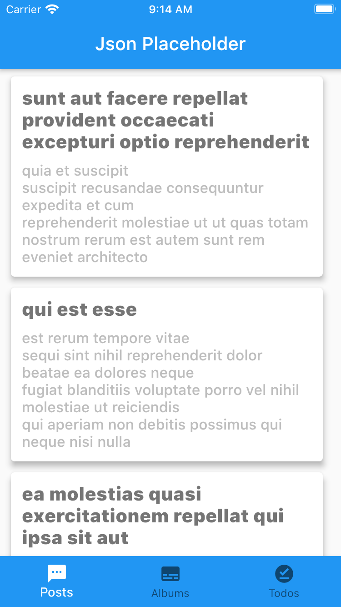
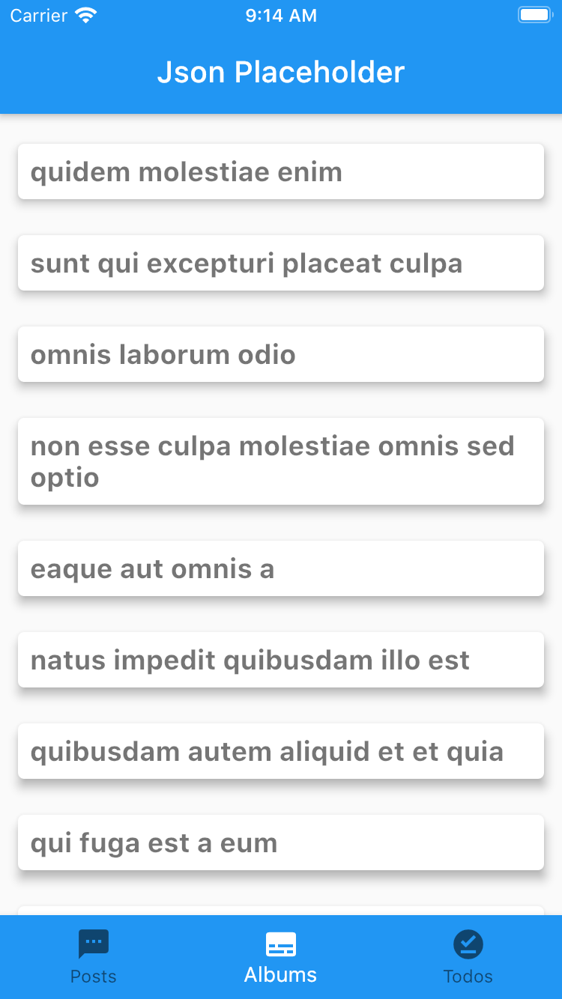
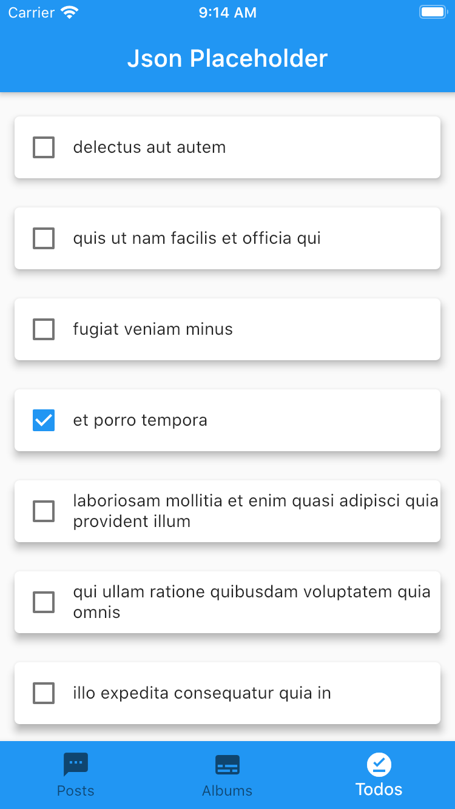
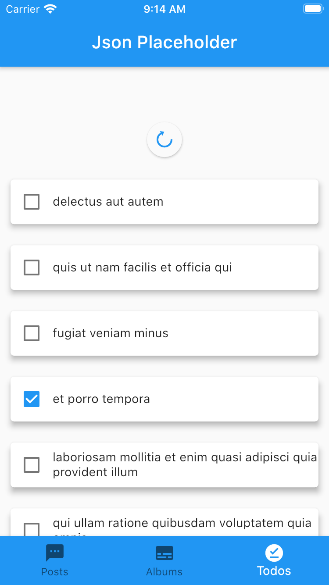
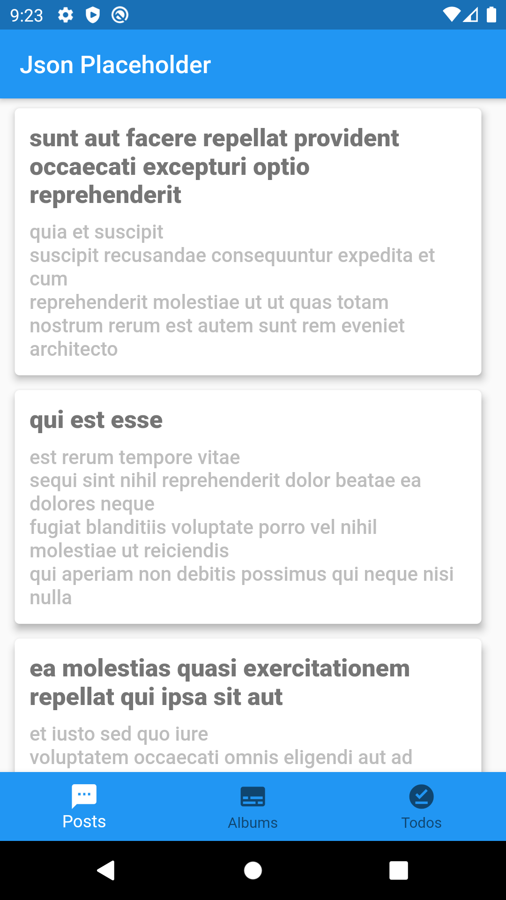
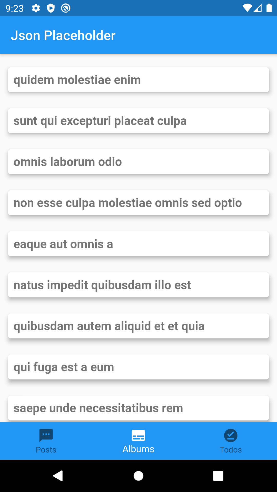
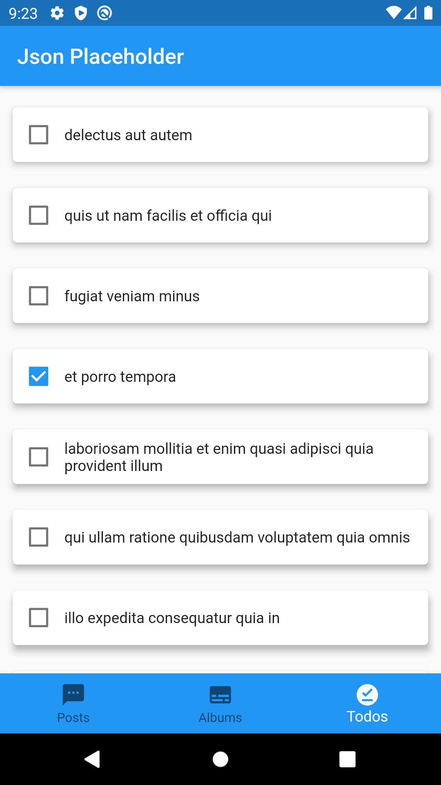
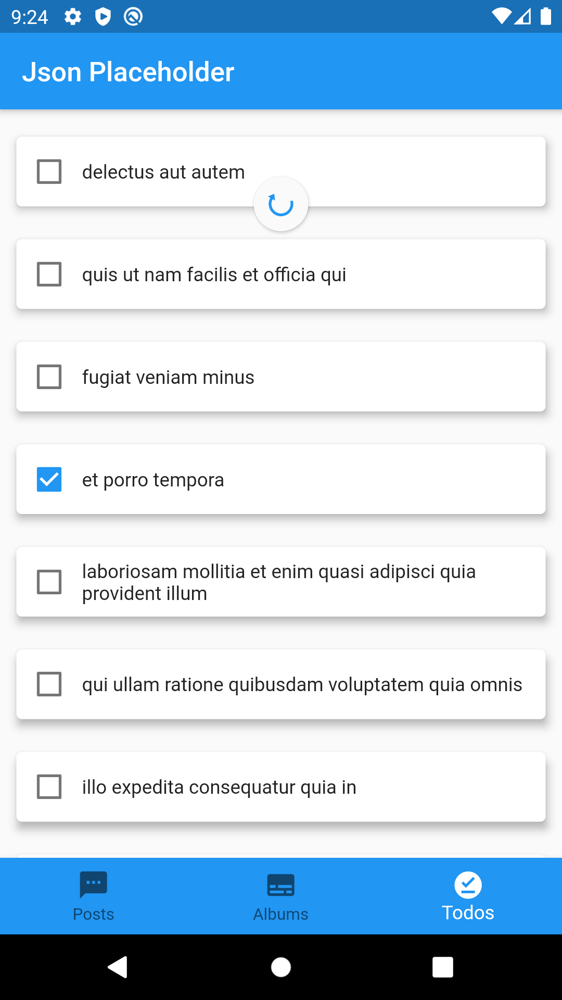

# Desafio Flutter - Framework

## Features

- Offline first
- Pull to refresh to get network data
- Used bloc pattern to build app

### Screenshots

#### ios

<table>
  <tr>
     <td>Post</td>
      <td>Album</td>
     <td>Todo</td>
     <td>Refresh to get web</td>
  </tr>
  <tr>
    <td></td>
    <td></td>
    <td></td>
    <td></td>
  </tr>
</table>

#### android

<table>
  <tr>
     <td>Post</td>
      <td>Album</td>
     <td>Todo</td>
     <td>Refresh to get web</td>
  </tr>
  <tr>
    <td></td>
    <td></td>
    <td></td>
    <td></td>

  </tr>
 </table>

